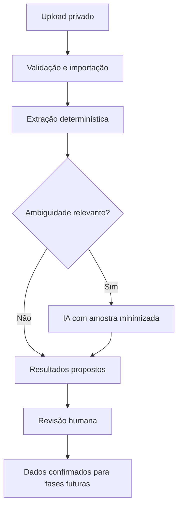

# Fase 3 — Planilha Inteligente

**Status:** especificação aprovada em 5 de agosto de 2026

## Objetivo

Entregar a primeira fatia do Leitor Inteligente: importar planilhas XLSX e CSV vinculadas a um processo de licenciamento, identificar dados geográficos, medições ambientais e checklists documentais, normalizar os dados sem alterar os valores originais e apresentar tudo para revisão humana.

O módulo prepara dados para o mapa e para a comparação normativa de fases posteriores. Ele não publica pontos no mapa, não aplica limites legais e não emite conclusão de conformidade.

## Resultado esperado

Ao final de uma importação válida, um usuário autorizado consegue:

1. consultar o estado e o resumo do processamento;
2. revisar as classificações atribuídas a cada aba ou tabela;
3. confirmar, corrigir ou rejeitar coordenadas detectadas;
4. revisar medições e suas normalizações propostas;
5. confirmar, editar ou rejeitar pendências documentais propostas;
6. rastrear qualquer resultado até o arquivo, a aba, a linha e as células de origem.

## Princípios do produto

- O Licença Rápida oferece triagem e suporte à decisão; a extração não equivale a licença, parecer ou aprovação técnica.
- Regras determinísticas e dicionários de domínio resolvem os casos conhecidos. IA é usada somente quando persistir uma ambiguidade relevante.
- O valor original é imutável. Normalizações, correções e confirmações são registros adicionais e auditáveis.
- Baixa confiança ou contexto insuficiente exige revisão humana; o sistema não escolhe silenciosamente entre interpretações concorrentes.
- Nenhuma pendência extraída se torna obrigação definitiva sem confirmação humana.
- Toda consulta e mutação respeita o isolamento por organização já estabelecido na Fase 2.

## Escopo

### Incluído

- Upload de XLSX e CSV para armazenamento privado.
- Vínculo obrigatório entre arquivo, organização e processo de licenciamento.
- Validação de extensão, assinatura do arquivo, tamanho e limites estruturais.
- Hash SHA-256 do arquivo e idempotência por organização, processo, hash e versão do extrator.
- Leitura segura de abas, cabeçalhos e células, sem execução de fórmulas, macros ou conteúdo ativo.
- Classificação múltipla de cada aba ou tabela como `coordenadas`, `monitoramento`, `checklist_documental` ou `tabular_generico`.
- Detecção de latitude/longitude e UTM.
- Detecção inicial de vazão, ruído, pH e DBO, com arquitetura extensível a outros parâmetros.
- Detecção de checklists documentais e criação de pendências com status inicial `proposta`.
- Normalização proposta de nomes, datas, números e unidades quando a transformação for inequívoca.
- Confiança, sinais utilizados, alertas, ambiguidades, evidência por célula e versão do extrator.
- Tela de revisão com resumo, coordenadas, monitoramento e pendências propostas.
- Auditoria das confirmações, edições, rejeições e reprocessamentos.
- Processamento parcial: falha em uma aba não apaga resultados válidos de outras abas.

### Fora deste recorte

- PDF, imagens, DOCX, OCR e demais formatos do Leitor Inteligente.
- DWG.
- Publicação de pontos ou áreas no mapa de restrições.
- Conversão silenciosa de UTM quando zona, hemisfério ou datum estiver ambíguo.
- Cruzamento geoespacial com APP, Unidade de Conservação, Terra Indígena ou recursos hídricos.
- Catálogo de limites legais, seleção da norma aplicável e conclusão de conformidade.
- Score de prontidão e relatório final.
- Criação automática de obrigação documental definitiva.
- Integração automática com CREA/CONFEA.

## Limites operacionais do MVP

| Limite                    |      Valor |
| ------------------------- | ---------: |
| Tamanho máximo do arquivo |      10 MB |
| Abas por arquivo XLSX     |         20 |
| Linhas por aba/tabela     |     50.000 |
| Tipos aceitos             | XLSX e CSV |

Arquivos acima desses limites são rejeitados antes da extração, com mensagem que identifica o limite excedido. Arquivos protegidos por senha, corrompidos, com tipo real divergente da extensão ou sem tabela legível também são rejeitados com explicação.

## Arquitetura

O módulo terá quatro fronteiras explícitas:

1. **Ingestão:** valida autorização e limites, armazena o arquivo em bucket privado e cria uma importação imutavelmente vinculada ao processo.
2. **Extração determinística:** lê metadados, cabeçalhos e valores; identifica tabelas; aplica detectores e normalizadores puros e versionados.
3. **Resolução de ambiguidade:** recebe somente cabeçalhos, amostras minimizadas e sinais necessários. A resposta estruturada da IA é validada antes de ser persistida e nunca substitui a evidência original.
4. **Revisão:** expõe resultados propostos e registra decisões humanas em operações idempotentes e auditáveis.

O núcleo de detecção e normalização será independente de Next.js, Supabase e do provedor de IA. A orquestração poderá executar o trabalho em lotes limitados e retomar a partir do último lote concluído, sem introduzir uma tecnologia de filas antes de haver necessidade comprovada.

## Estados da importação

Uma importação usa os seguintes estados:

| Estado                     | Significado                                                            |
| -------------------------- | ---------------------------------------------------------------------- |
| `recebendo`                | Upload ainda não confirmado no armazenamento privado                   |
| `aguardando_processamento` | Arquivo validado e pronto para extração                                |
| `processando`              | Há lote de extração em andamento                                       |
| `aguardando_revisao`       | Extração terminou e existe ao menos um candidato com estado `proposta` |
| `concluida`                | Todos os candidatos foram confirmados, editados ou rejeitados          |
| `concluida_com_alertas`    | Revisão terminou, mas alertas não bloqueantes permanecem               |
| `falhou`                   | Falha impediu a produção de qualquer resultado utilizável              |
| `cancelada`                | Usuário autorizado cancelou antes da conclusão                         |

O estado é derivado do progresso persistido, não de memória do processo. Uma tentativa interrompida pode continuar sem duplicar resultados. Se ao menos uma aba produzir resultado válido, a importação segue para revisão e registra as falhas das demais abas.

## Modelo conceitual de dados

### Importação e origem

- `spreadsheet_import`: organização, processo, objeto no Storage, nome original, MIME detectado, tamanho, hash, versão do extrator, estado, progresso e timestamps.
- `spreadsheet_sheet`: importação, nome original, índice, dimensões detectadas, classificações propostas, confiança, sinais, alertas e estado da aba.
- `source_cell`: aba, endereço A1, linha, coluna, cabeçalho original, valor bruto e representação textual segura.

O arquivo original permanece privado. Os registros de evidência guardam apenas os valores necessários para explicação e revisão, evitando copiar conteúdo não utilizado para logs de auditoria.

### Resultados propostos

- `coordinate_candidate`: sistema detectado, valores originais, CRS/datum informado ou inferido, valor transformado opcional, confiança, alertas e estado de revisão.
- `monitoring_candidate`: parâmetro original e normalizado, valor, unidade original e normalizada, data/hora, ponto, método, laboratório, prontidão para comparação futura, motivo e estado de revisão.
- `document_pending_item_candidate`: documento, obrigatoriedade informada na planilha, status original, validade, responsável, descrição proposta, confiança e estado de revisão.
- `candidate_evidence`: relação entre qualquer candidato e suas células de origem.

Os estados de revisão de um candidato são `proposta`, `confirmada`, `editada` e `rejeitada`. Uma edição preserva a proposta original e registra o valor confirmado separadamente.

### Execução e auditoria

- `spreadsheet_extraction_run`: importação, versão do extrator, tentativa, início, fim, métricas, erro sanitizado e resultado.
- `spreadsheet_review_event`: candidato, decisão, antes/depois, ator, justificativa opcional e timestamp.

Triggers ou funções controladas registram eventos relevantes no mecanismo de auditoria existente. Dados completos da planilha, prompts e respostas brutas não são copiados para `audit_logs`.

## Detecção e normalização

### Identificação de tabelas e cabeçalhos

- Detectar a linha de cabeçalho por densidade de texto, unicidade e consistência das linhas seguintes.
- Preservar cabeçalhos exatamente como recebidos e criar uma forma normalizada apenas para correspondência.
- Permitir mais de uma tabela por aba somente quando houver separação inequívoca; caso contrário, sinalizar a aba para revisão como `tabular_generico`.
- Uma aba pode receber mais de uma classificação, cada uma com confiança e sinais próprios.

### Latitude e longitude

- Reconhecer sinônimos como latitude, lat, longitude, lon, long e coordenadas.
- Validar latitude entre -90 e 90 e longitude entre -180 e 180.
- Verificar possíveis trocas de eixo e formatos decimais, sem corrigi-los silenciosamente.
- Não inferir hemisfério apenas a partir do município quando o sinal estiver ausente.

### UTM

- Reconhecer Easting/Este/E, Northing/Norte/N, zona/fuso e hemisfério.
- Exigir zona e hemisfério para conversão considerada confiável.
- Datum ausente, zona incompatível, valores trocados ou eixo ambíguo geram alerta e revisão.
- Guardar coordenada original e transformada separadamente, com CRS e método de transformação.

Neste recorte, coordenadas confirmadas ficam preparadas para o futuro mapa, mas não são publicadas como geometria oficial do processo.

### Monitoramento ambiental

- Reconhecer inicialmente vazão, ruído, pH e DBO, incluindo sinônimos configurados.
- Capturar unidade, data/hora, ponto de coleta, método e laboratório quando presentes.
- Converter números considerando separadores decimal e de milhar de forma inequívoca; formatos ambíguos permanecem sem normalização.
- Normalizar unidade somente quando a conversão for dimensionalmente segura e não depender de condição não informada.
- Definir `pronto_para_comparacao: false` quando faltar matriz/fração, unidade, período, método relevante ou outro contexto indispensável.
- Não selecionar norma nem classificar a medição como conforme ou não conforme.

### Checklist documental

- Reconhecer equivalentes de documento, obrigatório, entregue, validade, responsável, status e observação.
- Propor pendência quando a própria planilha indicar item obrigatório ausente, ilegível, vencido ou inconsistente.
- Não inferir obrigatoriedade jurídica apenas pelo nome do documento ou por conhecimento genérico do modelo.
- A confirmação humana cria ou vincula a pendência efetiva ao processo; edição e rejeição preservam a proposta para auditoria.

## Uso de IA

A IA só é chamada quando os detectores determinísticos não alcançam confiança suficiente ou produzem classificações concorrentes relevantes.

Entrada permitida:

- cabeçalhos;
- tipos inferidos;
- pequena amostra representativa de linhas;
- sinais e hipóteses dos detectores;
- dicionário de categorias e contrato estruturado.

Entrada evitada:

- arquivo completo quando uma amostra resolve a ambiguidade;
- colunas não relacionadas à classificação;
- fórmulas, macros, objetos incorporados e propriedades ocultas sem necessidade;
- segredos, credenciais ou conteúdo de outros processos.

Cada chamada registra versão do prompt/schema, modelo, latência, uso, resultado validado e identificador de correlação. O armazenamento de conteúdo bruto deve obedecer minimização e prazo de retenção definidos pela política de dados do produto. Falha, timeout ou resposta inválida da IA não apaga o resultado determinístico: a classificação permanece ambígua e segue para revisão humana.

### Política inicial de confiança

- Quando a melhor classificação determinística tiver confiança de pelo menos `0,90` e vantagem de pelo menos `0,15` sobre a segunda classificação, ela gera a proposta sem chamada de IA.
- Nos demais casos, a IA pode ser chamada uma vez para resolver a ambiguidade, sempre que houver amostra suficiente e permitida.
- Após a IA, confiança abaixo de `0,80`, diferença inferior a `0,10` entre classificações concorrentes ou ausência de contexto obrigatório mantém o item explicitamente ambíguo.
- Os limiares fazem parte da versão do extrator, são monitorados com fixtures e dados revisados e não podem ser alterados retroativamente em execuções anteriores.

Esses limiares controlam apenas classificação e priorização da revisão. Todo candidato permanece como proposta até decisão humana.

## Segurança e isolamento

- Bucket privado, sem URL pública permanente.
- Caminho do objeto inclui identificadores validados de organização e processo, mas a autorização nunca depende apenas do caminho.
- Upload e leitura usam autorização server-side e políticas RLS/Storage por organização.
- Apenas membros com permissão de edição de processo podem importar, reprocessar ou revisar; perfis somente leitura apenas consultam resultados permitidos.
- A chave composta entre processo e organização impede vínculo cruzado entre tenants.
- Fórmulas são tratadas como dados não executáveis. O sistema não avalia fórmulas, macros, links externos, consultas, scripts ou objetos incorporados.
- Nomes de arquivo e mensagens de erro são sanitizados antes de logs e interface.
- CSV é interpretado como texto tabular; conteúdo iniciado por `=`, `+`, `-` ou `@` permanece texto e deve ser escapado em futuras exportações.
- Downloads e pré-visualizações usam URLs assinadas curtas, geradas após autorização.

## Idempotência e reprocessamento

A chave lógica da extração combina `organization_id`, `licensing_process_id`, hash SHA-256 e versão do extrator. Uma solicitação repetida reutiliza a execução concluída ou retoma a execução incompleta, salvo quando o usuário solicita explicitamente nova versão.

Reprocessar com nova versão:

1. cria nova execução;
2. preserva execução e decisões anteriores;
3. não sobrescreve candidatos confirmados;
4. apresenta diferenças relevantes para revisão;
5. registra ator, motivo e versões comparadas.

## Experiência de revisão

A página da importação terá quatro áreas:

1. **Resumo:** arquivo, processo, estado, progresso, abas, classificações, alertas e versão do extrator.
2. **Coordenadas:** valores originais e transformados lado a lado, CRS, confiança, evidência e alertas.
3. **Monitoramento:** parâmetro, valor e unidade originais, normalização proposta, contexto capturado e prontidão para comparação futura.
4. **Pendências propostas:** documento, motivo, evidência, confiança e ações de confirmar, editar ou rejeitar.

Filtros permitem localizar itens ambíguos, de baixa confiança, não revisados ou pertencentes a uma aba específica. A interface usa linguagem de proposta e revisão, nunca “aprovado automaticamente” ou “conforme a lei”.

## Tratamento de erros

| Situação                                   | Comportamento                                                                     |
| ------------------------------------------ | --------------------------------------------------------------------------------- |
| Extensão aceita, assinatura incompatível   | Rejeitar antes de processar e explicar tipo inválido                              |
| Arquivo acima do limite                    | Rejeitar e informar limite aplicável                                              |
| XLSX protegido ou corrompido               | Rejeitar, sem tentar contornar a proteção                                         |
| CSV com codificação ou delimitador ambíguo | Pedir confirmação ou rejeitar com amostra segura; não interpretar silenciosamente |
| Aba vazia                                  | Registrar como ignorada com aviso                                                 |
| Uma aba falha                              | Preservar as demais e enviar a importação para revisão parcial                    |
| Fórmula sem valor calculado armazenado     | Manter a fórmula como evidência textual e marcar o valor como indisponível        |
| Conversão numérica ambígua                 | Preservar texto original e exigir revisão                                         |
| IA indisponível ou inválida                | Preservar resultado determinístico e marcar ambiguidade                           |
| Tentativa repetida                         | Reutilizar ou retomar pela chave idempotente                                      |
| Perda de autorização durante processamento | Interromper novas mutações e registrar erro sanitizado                            |

## Permissões

O módulo reutiliza os papéis da Fase 2:

| Ação                                     | `owner` | `admin` | `analyst` | `reviewer` | `viewer` |
| ---------------------------------------- | ------: | ------: | --------: | ---------: | -------: |
| Consultar importação e resultados        |     sim |     sim |       sim |        sim |      sim |
| Importar ou reprocessar planilha         |     sim |     sim |       sim |        não |      não |
| Confirmar, editar ou rejeitar candidatos |     sim |     sim |       sim |        sim |      não |
| Cancelar importação em andamento         |     sim |     sim |       sim |        não |      não |

Essas permissões seguem a capacidade atual de criação/edição/revisão de processos. Alterações futuras no modelo de papéis devem atualizar a matriz e as políticas RLS juntas.

## Observabilidade

Por importação e execução, registrar sem conteúdo sensível desnecessário:

- duração total e por etapa;
- quantidade de abas e linhas lidas;
- candidatos por categoria;
- proporção resolvida deterministicamente e pela IA;
- ambiguidades e falhas por código;
- volume processado e versão do extrator;
- decisões humanas e tempo até revisão.

Logs técnicos usam identificadores de correlação e erros sanitizados. Métricas devem permitir avaliar a meta do produto de reduzir o esforço de triagem sem expor dados ambientais ou documentais.

## Estratégia de testes

### Unidade

- Detecção de cabeçalhos e tabelas.
- Sinônimos de latitude/longitude, UTM, parâmetros e checklist.
- Faixas geográficas, troca de eixos e ausência de zona/hemisfério.
- Locales numéricos, datas e conversões de unidade seguras ou ambíguas.
- Classificação múltipla, confiança e sinais.
- Idempotência e transições de estado.

### Fixtures de arquivo

- XLSX com múltiplas abas e uma aba inválida.
- XLSX com fórmulas, fórmulas sem cache, macros/objetos rejeitados e valores comuns.
- CSV UTF-8 e codificação ambígua, com vírgula e ponto e vírgula.
- Latitude/longitude válidas, trocadas e fora da faixa.
- UTM completa e casos sem zona, hemisfério ou datum.
- Monitoramento com vazão, ruído, pH e DBO em unidades compatíveis e incompatíveis.
- Checklist com documento entregue, ausente, vencido e status ambíguo.
- Arquivos nos limites e acima de cada limite operacional.

### Banco e autorização

- RLS impede leitura e mutação entre organizações.
- Processo e arquivo não podem pertencer a organizações diferentes.
- `viewer` não importa nem revisa; `reviewer` revisa mas não importa.
- Repetição da mesma solicitação não duplica importação, candidatos ou eventos.
- Reprocessamento preserva versões e decisões anteriores.
- Auditoria não aceita mutação direta por usuário autenticado.

### Integração e interface

- Upload até revisão completa para cada uma das três categorias.
- Falha parcial por aba.
- Timeout/resposta inválida da IA com fallback para revisão.
- Confirmação, edição e rejeição preservam proposta e evidência.
- Estados vazios, carregamento, erro e retomada.
- Acessibilidade por teclado, rótulos e mensagens de erro.

## Critérios de aceite

1. Um XLSX ou CSV válido de até 10 MB pode ser associado a um processo da mesma organização e armazenado privadamente.
2. O sistema rejeita tipos reais inválidos e limites excedidos sem executar conteúdo ativo.
3. Cada aba produz zero ou mais classificações com confiança, sinais e ambiguidades.
4. Coordenadas latitude/longitude e UTM mantêm valores originais e referências às células; UTM ambígua não é convertida silenciosamente.
5. Vazão, ruído, pH e DBO são reconhecidos em fixtures representativas, mantendo valor/unidade originais e normalização proposta separada.
6. Checklist documental produz apenas pendências `proposta`, nunca obrigação definitiva automática.
7. Todo candidato pode ser rastreado até arquivo, aba, linha e células de origem.
8. Usuário autorizado confirma, edita ou rejeita candidatos; cada decisão fica auditada.
9. Falha de uma aba ou da IA não remove resultados determinísticos válidos de outras abas.
10. Repetir a mesma importação com a mesma versão não duplica resultados; nova versão preserva histórico.
11. Testes de RLS demonstram isolamento entre duas organizações e respeitam a matriz de papéis.
12. Nenhuma tela ou saída aplica limite legal, publica mapa ou apresenta conclusão de conformidade neste recorte.

## Sequência posterior

Depois desta fatia estar validada com planilhas reais, os próximos módulos poderão consumir somente candidatos confirmados:

1. publicação de coordenadas no mapa e cruzamento com camadas territoriais;
2. catálogo normativo e comparação de monitoramento com limites aplicáveis;
3. incorporação dos resultados revisados ao relatório de prontidão.

Cada módulo exigirá especificação e aprovação próprias.
